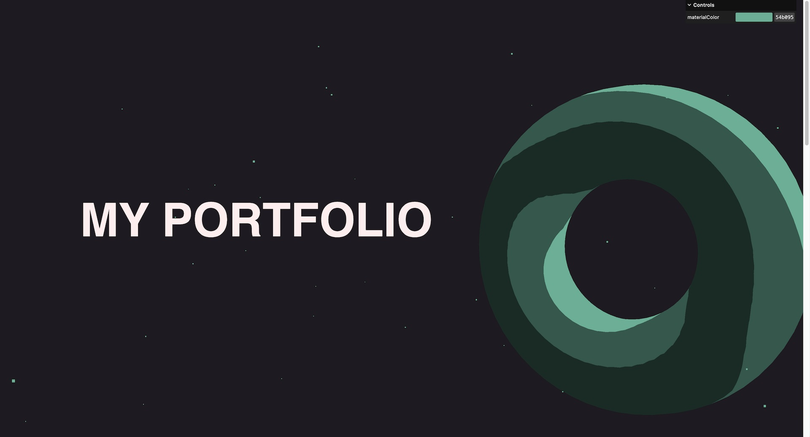

# Scroll-based Animation

This project explores scroll-based animation with 3D elements. It was created with Three.js.

It features a mock portfolio front page with floating 3D elements. The 3D elements will spin quickly in response to entering the viewport, and their position will adjust based on your mouse movement. In the upper-right corner is a GUI that allows users to dynamically adjust the color of the 3D elements.

The work was undertaken as one of many steps in acquiring [my Three.js certification](https://threejs-journey.com/certificate/view/24741) through [Three.js Journey](https://threejs-journey.com/).

## Live demo

A running demo of the project can be viewed at https://dvdjrnx.github.io/raging-sea

## Local development

### Installation

1. Clone the repository.
2. Install the required dependencies by running `npm install`.

### Usage

To start the project, run the following command:

`npm run dev`
